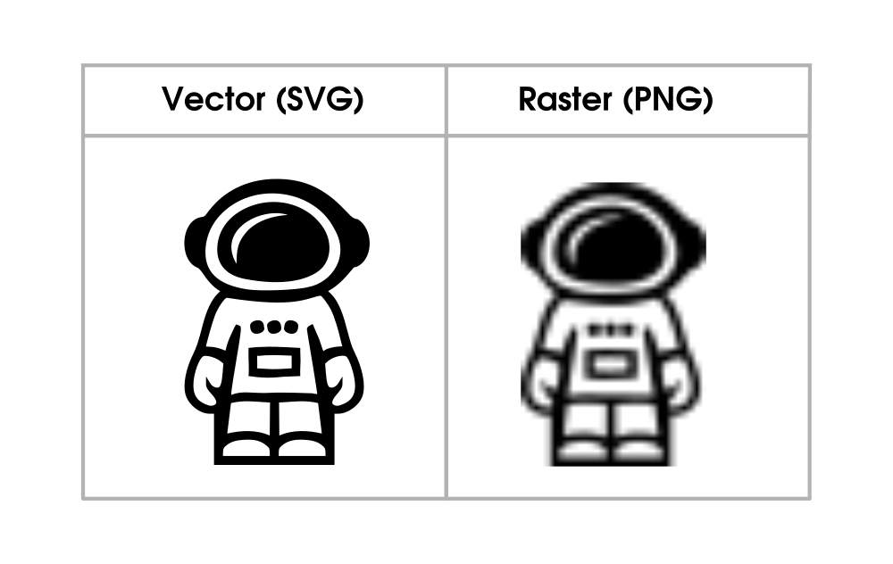
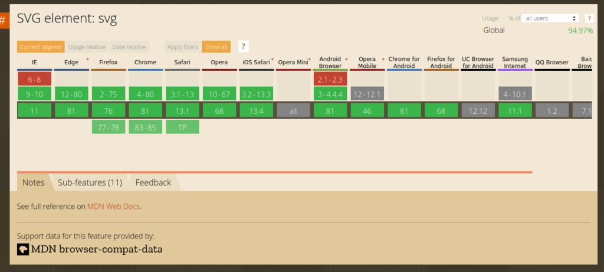

Created in 1999, SVG has grown to become the most popular vector image format for the web. This article will cover the advantages and disadvantages of SVG (Scalable Vector Graphics) as a format for displaying images on the web. By knowing the pros and cons of SVG, you can better identify the situations where SVG is preferable over other image formats like PNG.

## Advantages of SVG

Below are the most noteworthy benefits of using SVG over other formats like JPEG and PNG. 

**1. Easy to create and edit**

SVG files are based on XML (extensible markup language), a set of codes that describes the text in a digital document. This means that you can create and modify SVG files directly in a text editor, just as you would an ordinary text or HTML file. While vector graphic applications like Inkscape and Adobe Illustrator are easier to use, they are not necessary at all!

**2. Scalable**

Raster formats like PNG and JPG become pixelated when resized. Since SVG images are vector images, they do not suffer from loss of quality when resized or zoomed in the browser. This makes them suitable in cases where an image has to be scaled to fit different screen sizes. 

SVG graphics are resolution-independent. Other image formats may require extra assets/data to fix resolution-based issues, depending on the device. For example, in retina screens, a @2x hack is required to display higher-resolution images. SVG doesn’t have such hassles and can be resized easily no matter the device or resolution.

Below, you can see the same image when scaled in different formats. In SVG, the image retains its quality. When scaled in PNG, the image loses its quality and becomes pixelated.

**3. Flexible**

SVG is a W3C standard file format. Because of this, it works well with other open standard technologies, including CSS, JavaScript, and HTML. SVG-based images can be manipulated using JavaScript and CSS because they integrate into the DOM because technically, SVG images are XML code, not "real" images. 

**4. Can be animated**

SVG graphics can be animated using JavaScript and CSS, making it a powerful image format building interactive animations on the web. 

**5. Lightweight**

Compared to other formats, SVG images are very small in size. A PNG image can be up to 50 times larger its SVG counterpart at the same dimensions. 

**6. Indexable**

SVG files can be indexed by search engines. This means that they can be used  for SEO (Search Engine Optimization) purposes.

**7. Compressible**

Like other image formats, SVG files can be scripted and compressed.

**8. No unnecessary requests**

Since they are made up of XML, SVG files do not need the browser to request an image from a server, as is being done for standard images. This makes SVGs faster and user-friendlier for the web.

## Disadvantages of SVG

**1. Not detailed**

The SVG image format is great for 2D graphics like logos and icons but is not ideal for detailed pictures. SVG-based graphics can’t display as many details as standard image formats since they are rendered using points and paths instead of pixels

**2. Not fully cross-platform**

Even though SVG has been around since 1999 and is supported by most modern browsers (both on desktop and mobile), it does not work on legacy browsers (like IE8 and below). However, this is rarely an issue for modern web development as the vast majority of users are on browsers that support SVG. 

